# Personalized-treatment-based-on-patient-history
A Web portal to predict whether the person is diabetic, prediabetic or healthy and then provide him personalized prelimnary treatment in the form of diet and exercise plan. The name of the web portal is Myfitness. The system is made for 3 users mainly Patient, Doctor and Admin. The function of Admin is to Add new Doctors in the system. The function of Doctor is to view Appointments booked by the Patient. The Patient needs to register and Login to the system. After successfully login the user needs to fill up an Analysis form so that prediction can take place. Everytime the user fills up the Analysis form the data is given to Machine learning model and prediction takes place. I have used KNN model to predict weather the person is diabetic, prediabetic or healthy. The patient can also get the visualization of the input and the output parameters. The data set is taken from kaggle.  
## To run the project follow these simple steps:  
### Step 1: Clone or Donwload the rar file from the repository
### Step 2: Copy the files in to htdocs for xampp server and in www for wamp server
### Step 3: Create 3 database files in the phpmyadmin namely adminlogin.sql, mydatabase.sql, registration.sql 
### Step 4: After creating the files you need to import the databases from the database folder.
### Step 5: After importing the database the system is ready to use just you need the open the home page of the system which is index2.php 
### Step 6: Patient needs to login by clicking the login button and there ise separete login button for Admin and Doctor.
### Step 7: After login the patient needs to fill up the Analysis form and then the prediction will take place
### Step 8: The patient can check out the other features of the system like Check History, Visualization of input and output parameters, Customized Diet plan and Exercise plan, Book Appointment with Doctor 
### I have also uploaded the Technical Paper with the name "B21 Updated Paper". It is a paper I have published in my college.
### Home page of System
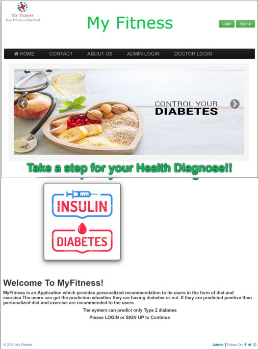
### Login Screen
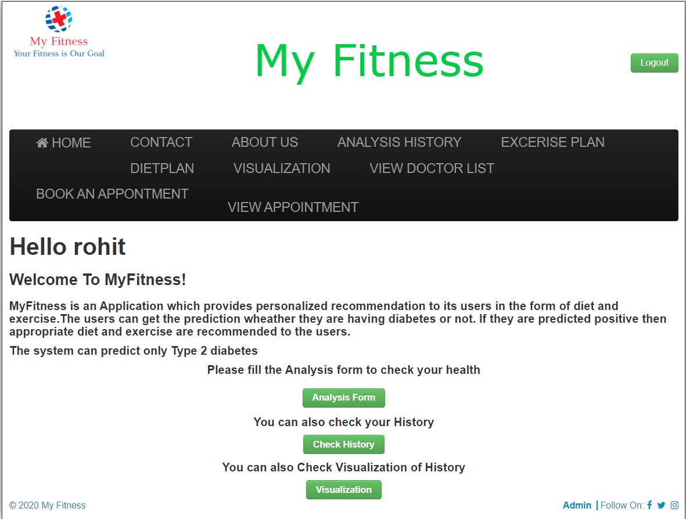
### Analysis Form
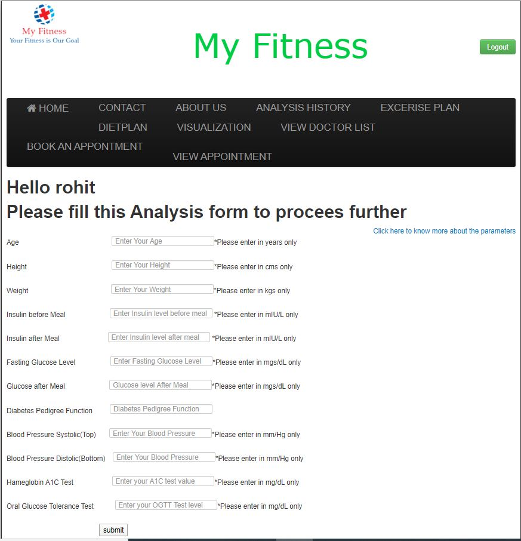
### Actual Prediction
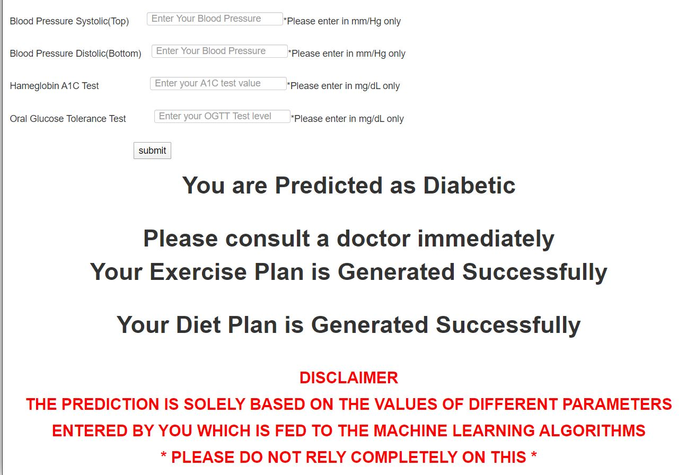
### Analysis History
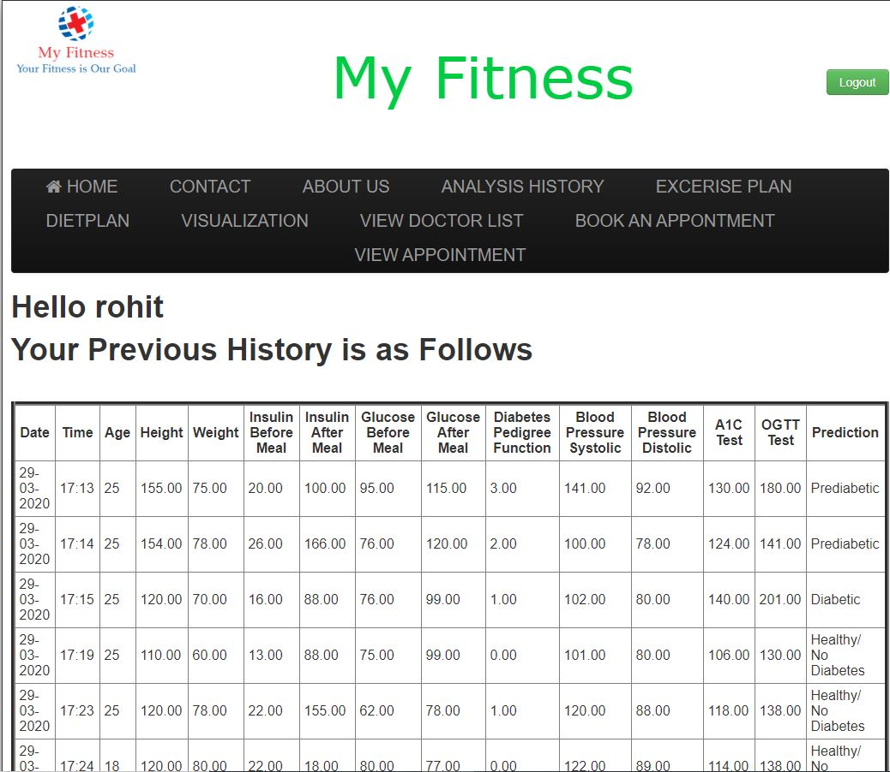
### Appointment History
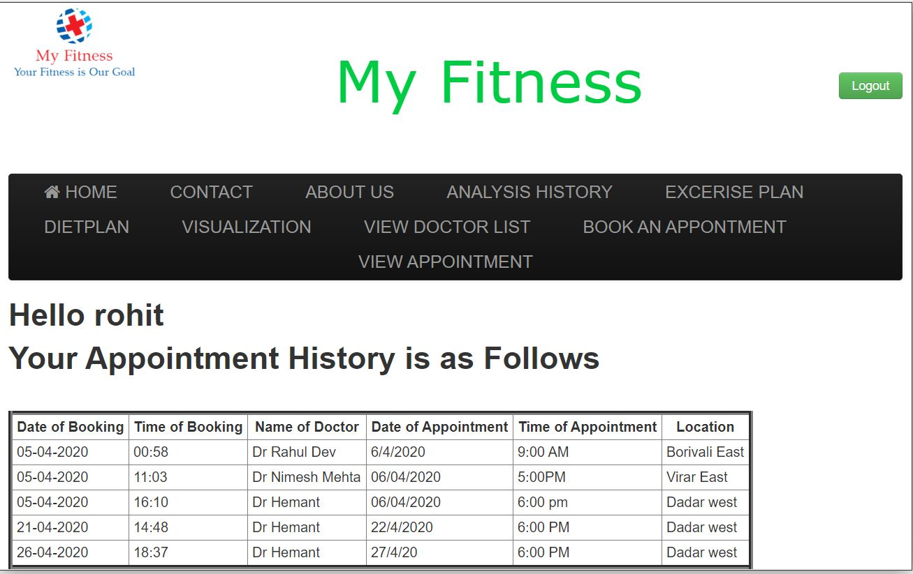
### Booking Appointment
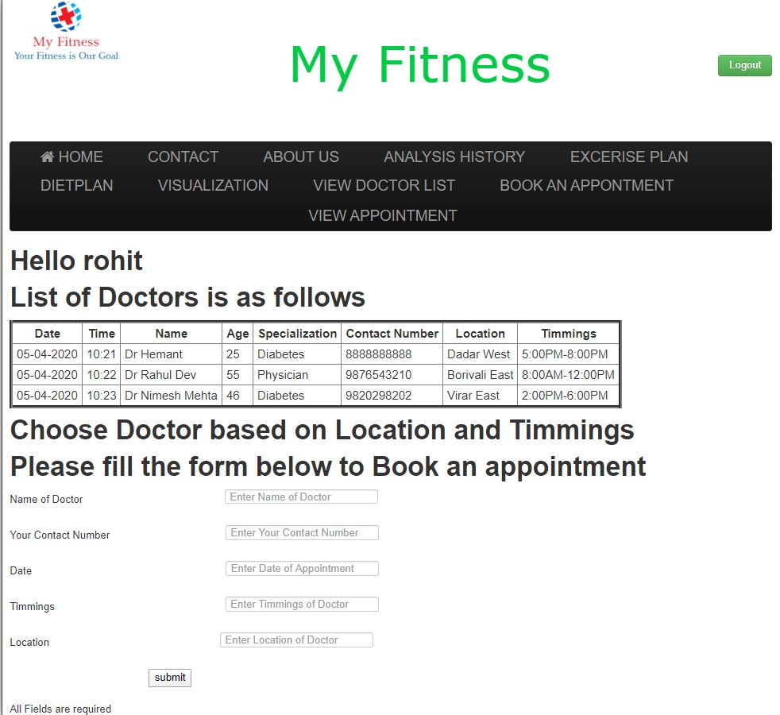
### Diet Plan
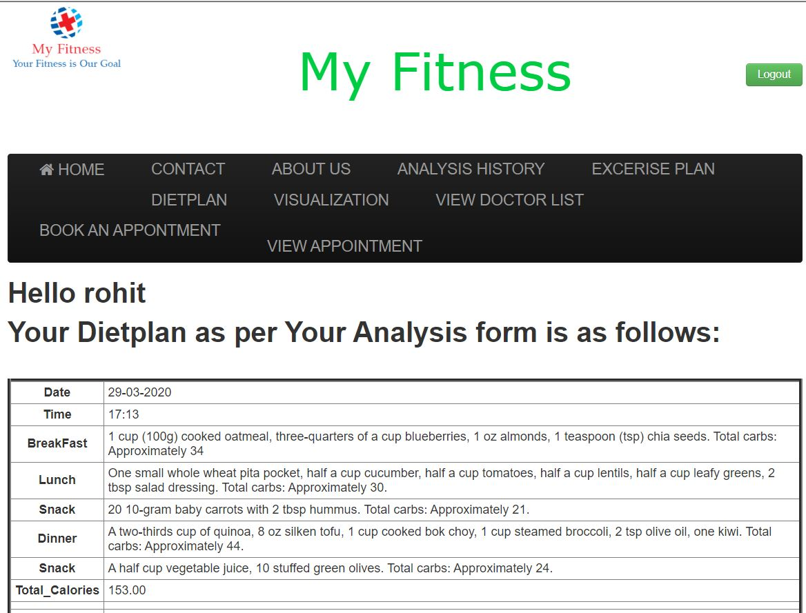
### Exercise Plan
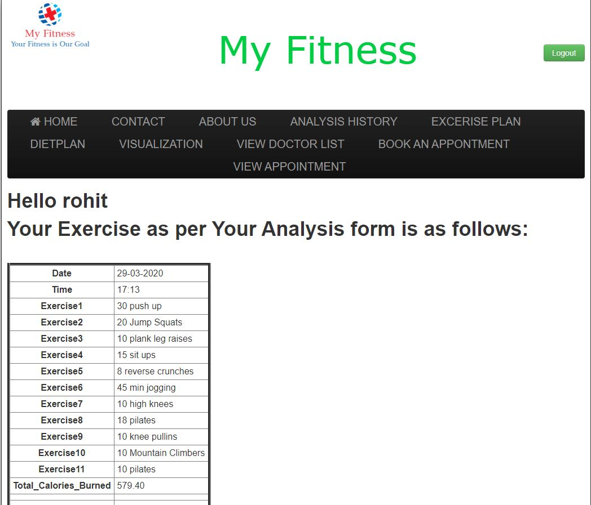
### Doctor Login
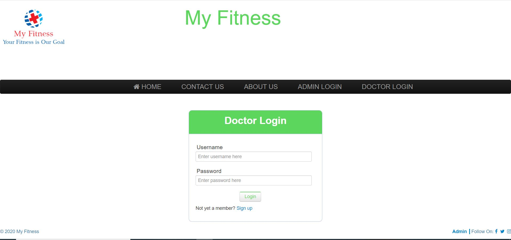
### Admin Login
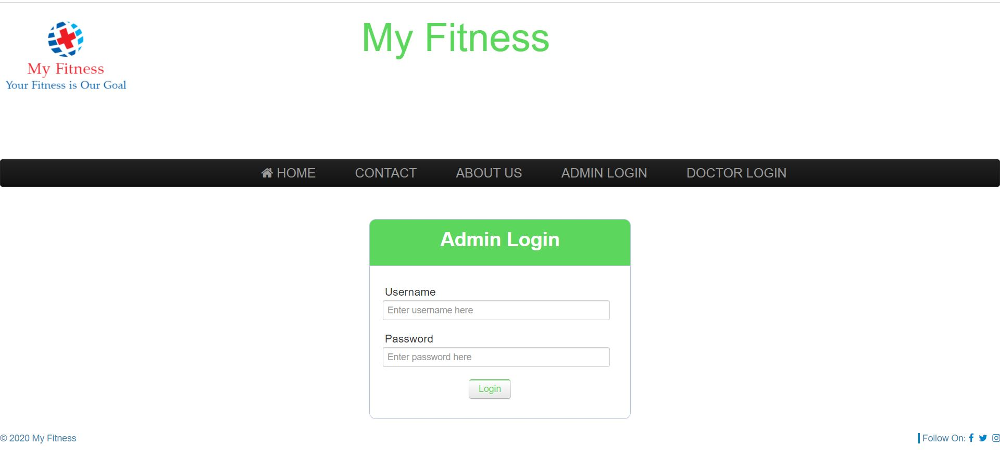
### Visualization
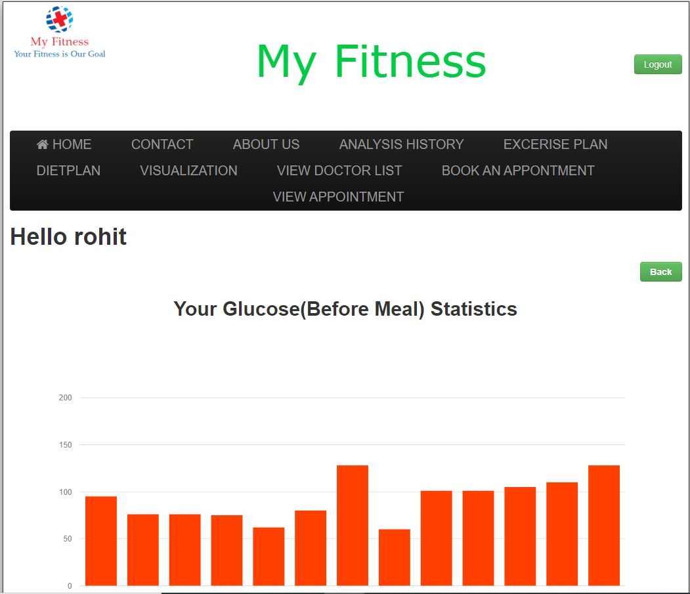
### [Paper Presentation on Multicon W ICICN 2020 Personalized Treatment Based On Patient History](https://github.com/nitesh-tiwari-cse/Personalized-treatment-based-on-patient-history/blob/main/Paper%20Presentation%20on%20Multicon%20W%20ICICN%202020%20Personalized%20Treatment%20Based%20On%20Patient%20History%20.pdf)

